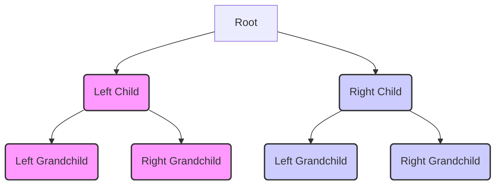

# Project: Binary Search Trees

`Time to complete: 7~ hrs`
Had a lot of fun with this one

- experienced more on what it feels like to write code for myself if i didn't write comments maybe i would've easily lost focus, but like this i can be less concerned about parts i took the time to figure out instead of having to re-figure things out every time something goes wrong (you will always write code that will produce an error its part of being a human) writing little comments to know witch things you got right is crucial

`after this is where ai writes`

This project implements a basic Binary Search Tree data structure in JavaScript, based on concepts learned in The Odin Project's curriculum.

## What is a Binary Search Tree?

A Binary Search Tree (BST) is a node-based data structure where each node has at most two children, referred to as the left and right children. For a valid BST, the value of any node in the left subtree is less than the node's value, and the value of any node in the right subtree is greater than the node's value. This structure allows for efficient searching, insertion, and deletion of elements.

Here's a simple representation of a Binary Search Tree:



## Project Structure

The implementation is split into three main files:

- `Node.js`: Defines the `Node` class, representing a single node in the tree. Each node contains `data` and references to its `left` and `right` children.
- `Tree.js`: Defines the `Tree` class, which manages the tree structure starting from the `root`. It includes methods for building, manipulating, and traversing the BST.
- `main.js`: Provides an example of how to create and use the `Tree` class, demonstrating various operations.

## `Node` Class

The `Node` class is a simple structure:

```javascript
export class Node {
  constructor(data) {
    this.data = data
    this.left = null
    this.right = null
  }
}
```

- `constructor(data)`: Initializes a new node with `data` and sets `left` and `right` child pointers to `null`.

## `Tree` Class

The `Tree` class provides the following methods:

- `constructor(arr)`: Builds a balanced BST from a sorted, unique array.
- `static buildTree(arr)`: Static method to build a balanced BST recursively from a sorted array.
- `static prettyPrint(node)`: Static method to visually print the tree structure to the console.
- `insert(value)`: Inserts a new node with `value` into the tree.
- `deleteItem(value)`: Removes the node with the specified `value` from the tree.
- `find(value)`: Returns the node with the given `value`.
- `levelOrder(callback)`: Traverses the tree level by level (Breadth-First Search) using an iterative approach, applying a callback function to each node.
- `levelOrderRec(callback)`: Traverses the tree level by level using a recursive approach, applying a callback function to each node.
- `preOrder(callback)`: Traverses the tree Depth-First using pre-order traversal (Node, Left, Right), applying a callback.
- `inOrder(callback)`: Traverses the tree Depth-First using in-order traversal (Left, Node, Right), applying a callback. This traversal visits nodes in ascending order of their data.
- `postOrder(callback)`: Traverses the tree Depth-First using post-order traversal (Left, Right, Node), applying a callback.
- `height(value)`: Returns the height of the node with the given `value` (number of edges from the node to the deepest leaf in its subtree).
- `depth(value)`: Returns the depth of the node with the given `value` (number of edges from the root to the node).
- `isBalanced()`: Checks if the tree is balanced (the difference in height between the left and right subtrees of any node is no more than 1).
- `rebalance()`: Rebalances an unbalanced tree.

## Example Usage

You can see an example of how to use the `Tree` class in `main.js`. The example demonstrates creating a tree from a random array, pretty printing, checking balance, performing traversals, inserting nodes, checking balance again, rebalancing the tree, and finally showing the traversals after rebalancing.

```javascript
import { Tree } from './Tree.js'

// Create a random array and build the tree
function getRandomNumber(n = 100) {
  /* ... */
}
const tree = new Tree(getRandomNumber())
Tree.prettyPrint(tree.root)
console.log('1- isBalanced(): ', tree.isBalanced())

// Perform and log Depth-First Traversals
let preOrder = []
tree.preOrder((n) => preOrder.push(n.data))
// ... inOrder and postOrder
console.log(
  `2- All Elements (Depth-First Traversal):\n  Pre Order: [${preOrder.toString()}]\n\n  In Order: [...]\n\n  Post Order: [...]\n  `
)

// Insert new values
for (let i = 0; i < 10; i++) {
  tree.insert(i + 101)
}

// Check balance after insertion
console.log('3- isBalanced(): ', tree.isBalanced())
console.log('4- Balancing')

// Rebalance the tree
tree.rebalance()
console.log('5- isBalanced(): ', tree.isBalanced())

// Perform and log Depth-First Traversals after rebalancing
preOrder = []
tree.preOrder((n) => preOrder.push(n.data))
// ... inOrder and postOrder
console.log(
  `6- All Elements (Depth-First Traversal):\n  Pre Order: [${preOrder.toString()}]\n\n  In Order: [...]\n\n  Post Order: [...]\n  `
)
```

This example provides a clear demonstration of the core functionalities of the `Tree` class, including building, traversing, modifying, and rebalancing a Binary Search Tree.
